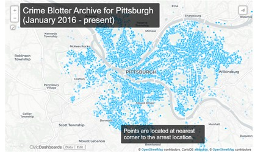

# Big Ideas Final
---
Contain in this repository is our final project. The code provided helps determine what the best neighborhood in Pittsburgh is, based on our opinion.

## Team Members
Hayden Terek - hdt4@pitt.edu

Jakob Ross - jjr113@pitt.edu

## Datasets Used and Description of Each
**[Police Incidents](https://data.wprdc.org/dataset/uniform-crime-reporting-data/resource/044f2016-1dfd-4ab0-bc1e-065da05fca2e)**

  This data set depicts every police-reported incident in the Pittsburgh region. It includes information such as the time, location, neighborhood, and a description of each incident. It also gives each incident a hierarchy value, which is used to determine the severity of the incident.
  

**[Property Sale Transactions](https://data.wprdc.org/dataset/real-estate-sales)**

This data set was used to look at which neighborhoods had the lowest cost for housing and the highest. From here, it was determined what was the best neighborhood for living. This can be found in the corresponding notebook. 

**[Police Firearm Seizures](https://data.wprdc.org/dataset/pbp-fire-arm-seizures)**

The above graphic shows the amount of firearms that were taken by Pittsburgh police. This graph only shows the total per month rather than a graph that shows per neighborhood.

Graphic is from: https://data.wprdc.org/dataset/pbp-fire-arm-seizures/resource/e967381d-d7e9-48e3-a2a2-39262f7fa5c4?view_id=516aa045-87a6-494b-8e87-252ff768d781

## Summary of Findings

Our findings lead us to believe that the best neighborhood is one with little to no crime, good pricing for housing, and little to no problems with weapons that are used to cause harm. From our research, we are lead to believe the best neighbor hood in Pittsburgh is **Mt. Oliver Boro**.
